# 计算机网络

网络数据包格式

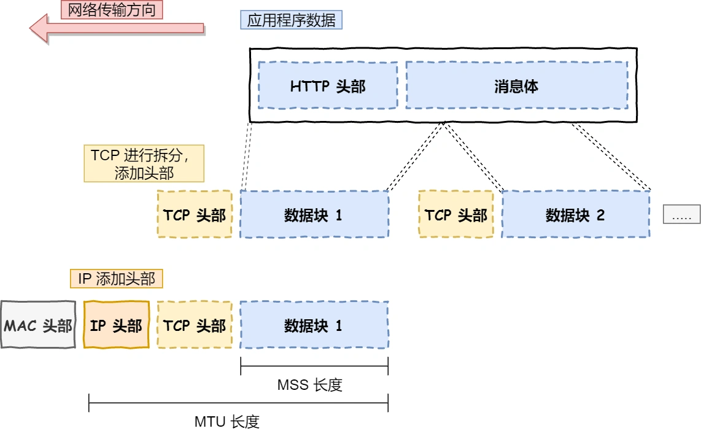

网络包大小

Maximum Transmission Unit（MTU）= IP Header + TCP Header + MSS

Maximum Segmant Size（MSS）= MTU - IP Header - TCP Header

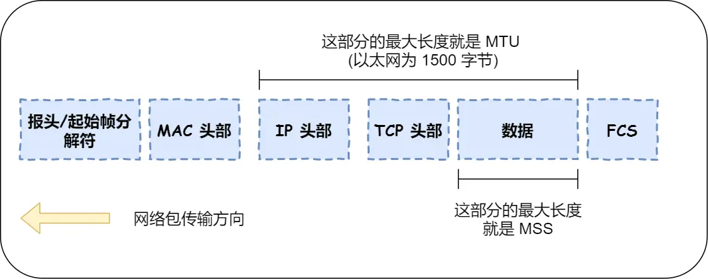

tcp头部

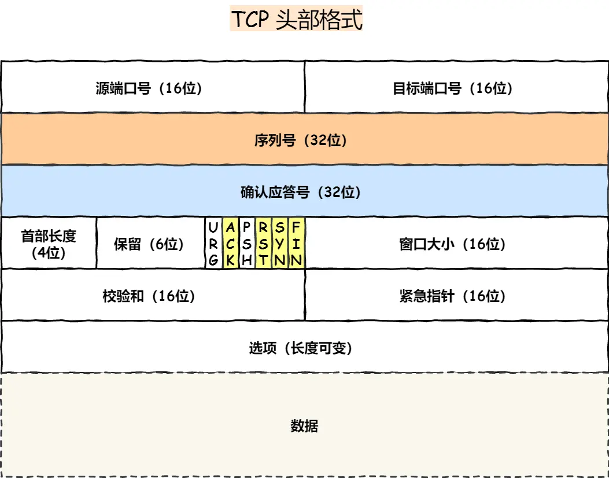

udp头部

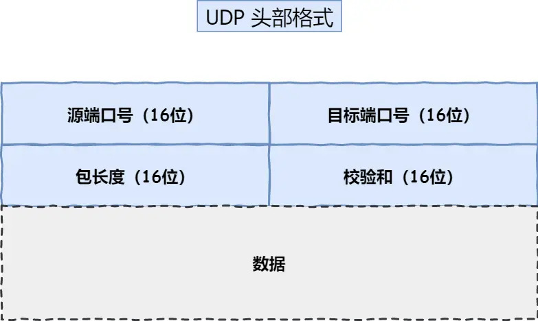

TCP三次挥手

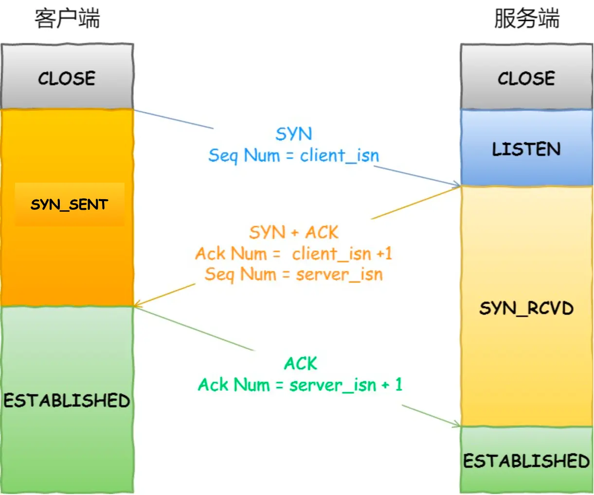

TCP四次挥手

Maximum Segment Lifetime （MSL），报文最大生存时间

IP Header里面的TTL字段，一般为64，Linux将MSL设置为30秒。

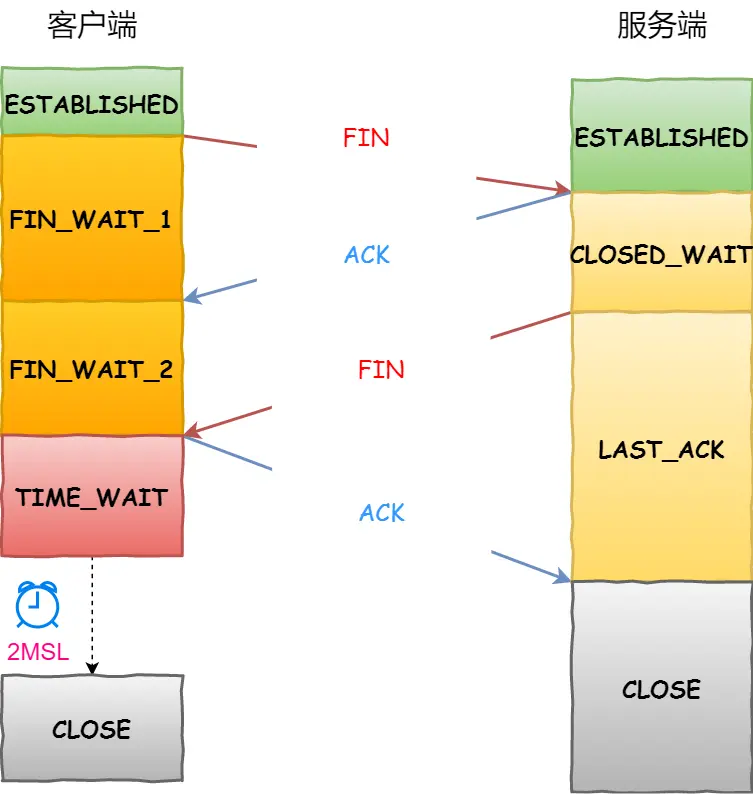

TCP作为一个面向连接的、可靠的传输协议，内部实现了一个**重传计时器**来保证数据能传输到对方。每发送一个数据包，就给这个数据设置一个重传计时器。如果在计时器超时之前收到了针对这个数据包的ack，就取消这个计时器。如果没有收到，则开始发起重传。计时器超时的时间被称为RTO，这个时间的确定取决于RTT

关于两者详细的解释：

- `RTT(Round Trip Time)`：一个连接的往返时间，即数据发送时刻到接收到确认的时刻的差值；
- `RTO(Retransmission Time Out)`：重传超时时间，即从数据发送时刻算起，超过这个时间便执行重传

对于segment的重传，重传的时间RTO设定是非常重要的，如果设置太短，可能会导致并没有丢包而重传，如果设置太长了，可能因为等待ACK而浪费掉很多时间，牺牲传输的效率。从思想上来讲，其实我们还是希望重传的时间需要稍稍的大于RTT就可以了。但是这个RTT没有什么可以使用的定值，它是不断变化的
注意建立TCP三次握手的超时重传跟传输segment的重传次数跟时间不同。

在Ubuntu18.04下，tcp的syn重传次数为6次，其中第一次重传时间为1s，第二次为2s，依次指数增长

```shell
cat /proc/sys/net/ipv4/tcp_syn_retries
6
```

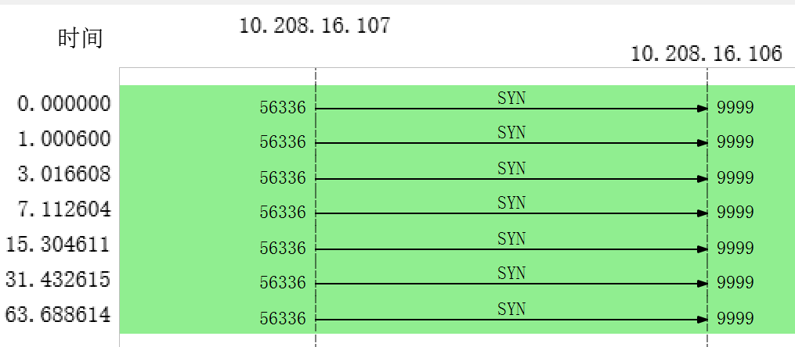

如果tcp三次握手的第二次握手丢包，会出现如下图情况，客户端的SYN会超时重发，服务端SYN/ACK也会超时重发，不过客户端SYN重发后会重置SYN/ACK的重传定时器，不会达到tcp_synack_retries的最大重传次数。直到SYN达到最大重传次数后，不再重置服务端SYN/ACK超时定时器，才会重发一直达到最大次数5次

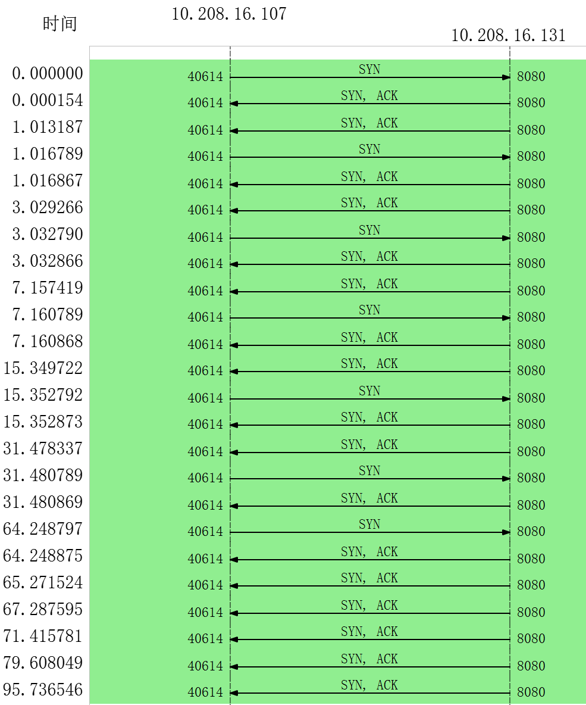

这里设置服务端丢掉第三次握手的ACK，来达到第二次握手SYN/ACK超时重传。可以看到这里SYN/ACK超时重传了5次。每一次重传时间是上次的2倍，指数增长。

```shell
cat /proc/sys/net/ipv4/tcp_synack_retries
5
```

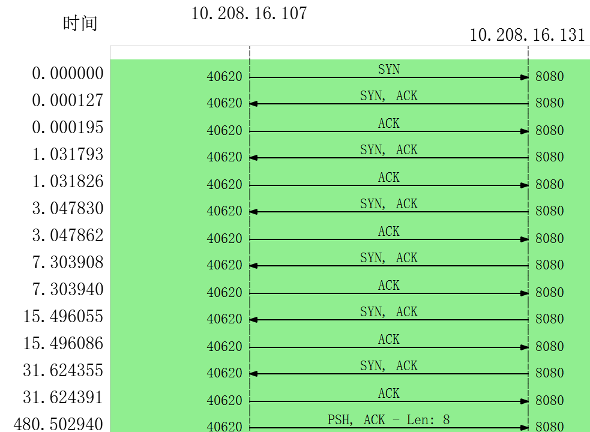

传输segment数据包的重传，TCP 建立连接后的数据包传输，最大超时重传次数是由 `tcp_retries2` 指定，默认值是 15 次。

```shell
cat /proc/sys/net/ipv4/tcp_retries2
15
```

这里建立TCP连接后重传时间是由RTO决定的，这个RTO是动态变化的。这里设置iptables防火墙让服务端丢弃客户端发送ACK标志的数据包，可以看到PSH_ACK数据包一直发送了15次后，就主动断开连接。这里可以注意到它的重传时间间隔首次是动态按照RTO来设置的，第一次大约为0.2s，第二次为0.4s，每一次重传时间是上次的2倍，指数增长，直到达到15次。

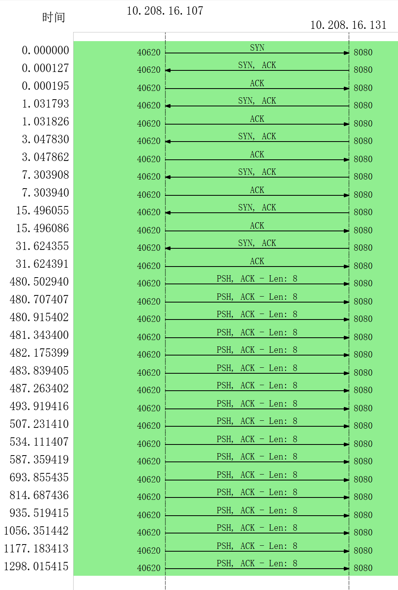

TTCP 的 **保活机制**。

定义一个时间段，在这个时间段内，如果没有任何连接相关的活动，TCP 保活机制会开始作用，每隔一个时间间隔，发送一个「探测报文」，该探测报文包含的数据非常少，如果连续几个探测报文都没有得到响应，则认为当前的 TCP 连接已经死亡，系统内核将错误信息通知给上层应用程序。

```shell
cat /proc/sys/net/ipv4/tcp_keepalive_time
7200
cat /proc/sys/net/ipv4/tcp_keepalive_intvl
75
cat /proc/sys/net/ipv4/tcp_keepalive_probes
9
```

- tcp_keepalive_time=7200：表示保活时间是 7200 秒（2小时），也就 2 小时内如果没有任何连接相关的活动，则会启动保活机制
- tcp_keepalive_intvl=75：表示每次检测间隔 75 秒；
- tcp_keepalive_probes=9：表示检测 9 次无响应，认为对方是不可达的，从而中断本次的连接。

也就是说在 Linux 系统中，最少需要经过 2 小时 11 分 15 秒才可以发现一个「死亡」连接。注意这里如果是通过保活机制被动关闭连接的话，是不会发送FIN标志的数据包。

下面是服务端拒绝客户端带PSH标志请求的过程。

首先建立连接（三次握手），接着客户端重发PSH数据包，最后由服务端主动断开连接。

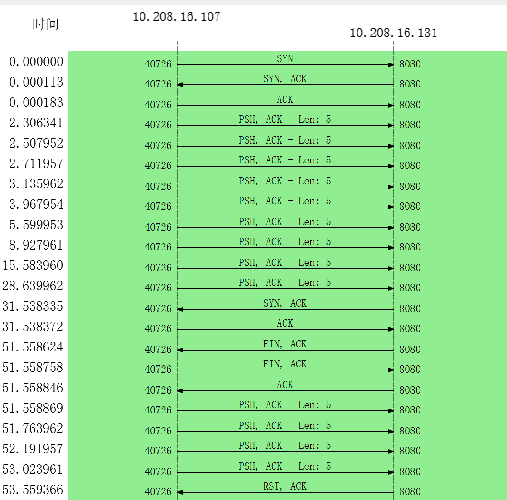